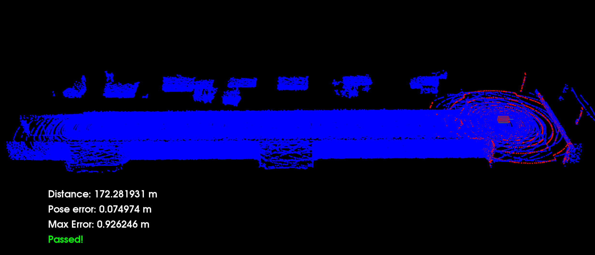

# Scan Matching Localization
This is the project for the third course in the Udacity Self-Driving Car Engineer Nanodegree Program: Localization

## Compile the Code
```
cd c3-project
cmake .
make
```

## Run the Code
```
su - student // Ignore Permission Denied, if you see student@ you are good
cd /home/workspace/c3-project
./run_carla.sh
// Create new tab
cd /home/workspace/c3-project
./cloud_loc // Might have core dump on start up, just rerun if so. Crash doesn't happen more than a couple of times
```

## Additional Information
I only added code in the c3-main.cpp file. 

## Results
The goal of the project was to drive the vehicle at least 170 meters without the pose error rising above 1.2 meters, at an at least medium speed (three up arrow taps in the workspace).    
By using ICP matching I achieve a maximum error of 0.926 meters. The following image shows the result.


